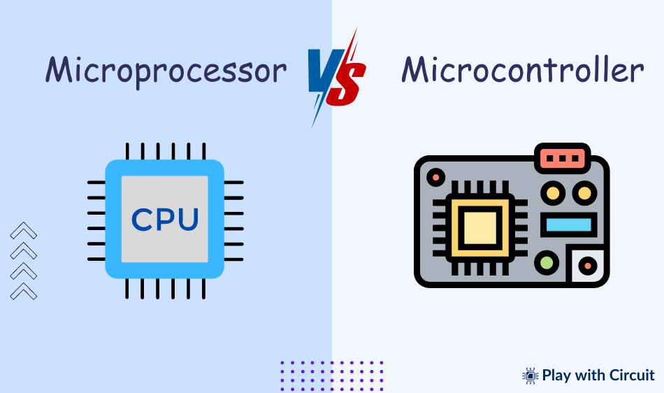

# ⚙️ ໄມໂຄຣໂປຣເຊດເຊີ (Microprocessor) vs ໄມໂຄຣຄອນໂທຣເລີ (Microcontroller)

---

## 🧠 ໄມໂຄຣໂປຣເຊດເຊີ (Microprocessor)

- **ອົງປະກອບ:** ປະກອບມີພຽງແຕ່ຫົວປະມວນຜົນກາງ (CPU) ເທົ່ານັ້ນ  
- **ໜ້າທີ່:** ຖືກອອກແບບມາສຳລັບວຽກງານທົ່ວໄປທີ່ຕ້ອງການປະສິດທິພາບສູງ  
- **ສ່ວນປະກອບ:** ຕ້ອງການອຸປະກອນເສີມພາຍນອກເຊັ່ນ RAM, ROM, ແລະ I/O ເພື່ອເຮັດວຽກເປັນລະບົບ  
- **ການນຳໃຊ້:** ຄອມພິວເຕີໂຕະ, ເຊີເວີ, ແລະອຸປະກອນມືຖື  
- **ພະລັງງານ ແລະ ລາຄາ:** ໃຊ້ພະລັງງານຫຼາຍ ແລະ ມີລາຄາແພງເນື່ອງຈາກເປັນອົງປະກອບທີ່ມີປະສິດທິພາບສູງ  

---

## ⚙️ ໄມໂຄຣຄອນໂທຣເລີ (Microcontroller)

- **ອົງປະກອບ:** ປະກອບມີ CPU, RAM, ROM, ແລະພອດ I/O ທັງໝົດຢູ່ໃນຊິບດຽວ  
- **ໜ້າທີ່:** ອອກແບບເພື່ອປະຕິບັດວຽກງານສະເພາະໃນລະບົບຝັງຕົວ  
- **ສ່ວນປະກອບ:** ອົງປະກອບທີ່ຈຳເປັນທັງໝົດຖືກລວມໄວ້ພາຍໃນ ແລະ ຕ້ອງການການເຊື່ອມຕໍ່ພາຍນອກໜ້ອຍລົງ  
- **ການນຳໃຊ້:** ເຄື່ອງໃຊ້ໃນເຮືອນ, ອຸປະກອນທາງການແພດ, ລະບົບຍານພາຫະນະ, ແລະອຸດສາຫະກຳອັດຕະໂນມັດ  
- **ພະລັງງານ ແລະ ລາຄາ:** ໃຊ້ພະລັງງານນ້ອຍ, ປະຫຍັດຄ່າໃຊ້ຈ່າຍ, ແລະເຮັດວຽກດ້ວຍຄວາມໄວຕ່ຳເຫມາະສົມກັບວຽກງານສະເພາະ  

---

## 📘 Summary (English)

| Feature | Microprocessor | Microcontroller |
|----------|----------------|----------------|
| **Composition** | Only CPU | CPU + RAM + ROM + I/O |
| **Function** | General-purpose, high-performance tasks | Dedicated control tasks |
| **Components** | Needs external memory & I/O | All built-in on single chip |
| **Applications** | PCs, servers, mobile devices | Appliances, cars, IoT devices |
| **Power & Cost** | High power, expensive | Low power, cost-effective |

---

### 🧩 Conclusion
Microprocessors are suited for **complex computing systems**, while microcontrollers are ideal for **specific embedded control applications**.
